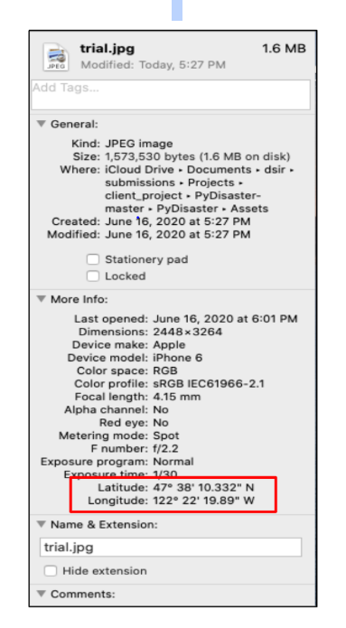
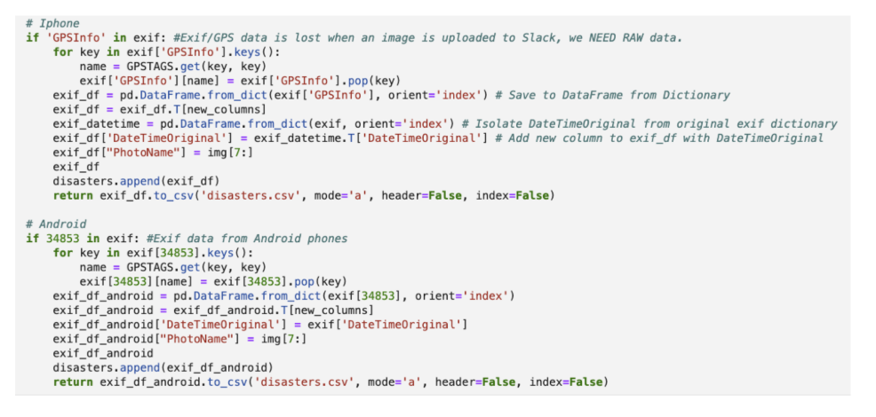
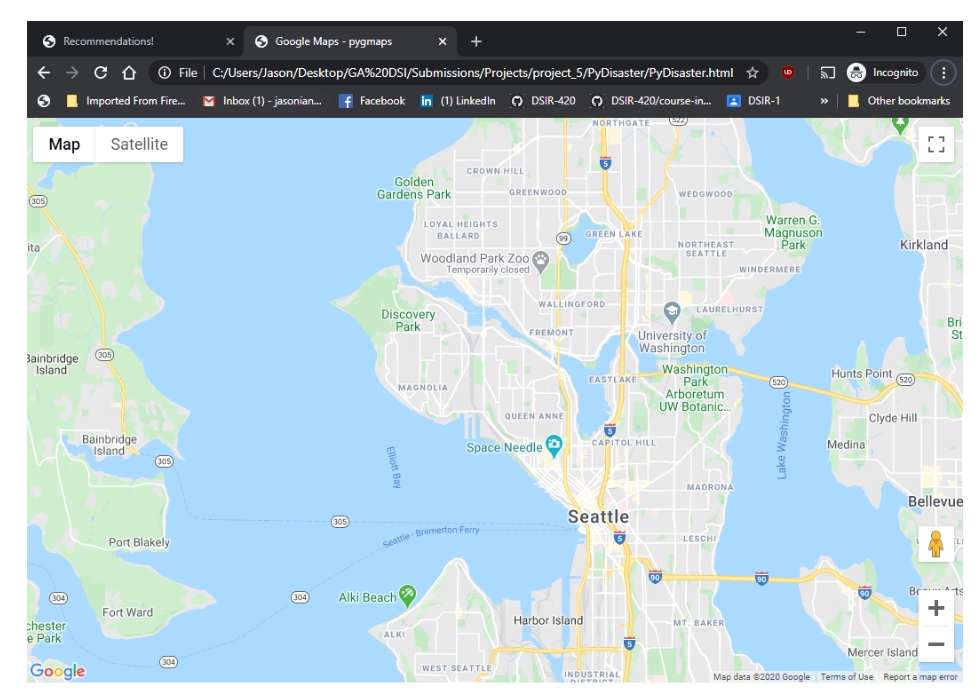

# PyDisaster: Crowdsourcing Damage Photos

### Problem Statement: 
Imagery is scarce at the start of a disaster. FEMA and partners rely on photos and other imagery to understand the disaster impacts and validate reports of damage. However, it is almost impossible to systematically acquire imagery the first day. Within the first few days, FEMA typically receives several types of satellite data. Within a week, other aerial imagery becomes available. Photos posted to social media can help fill in gaps in the interim, but these images are not captured systematically. The entire emergency management community would benefit from an app or service that anyone in an impacted area could use to take and submit photos. Ideally, these photos could be attained with cameras people may have on them (e.g. iPhones) or low-cost cameras. We need a systematic image capture workflow in order to conduct AI/ML/edge computing to conduct damage assessments. (Doing this from the ground would probably be quicker/easier than waiting on the winds to dissipate so you can fly planes.)

### Proposed Deliverables:
During disasters, FEMA needs to know the exact location of the damaged places. It is crucial to pinpoint a place and evaluate the damage when dispatching the resources. Our PyDisaster project can help to extract GPS location from photos submitted to our platform us AI/ML/edge computing technology. We created a master function takes each image submitted to our site and pulls the GPS location and exif data from it and opens a Google Maps search of the location. This will allow FEMA to conduct damage assessments in those effected areas.

### Required Installations:
Imports: pandas, requests, os, io, json

from google.cloud import vision

from google.cloud.vision import types

from google.oauth2 import service_account

from flask import Flask, render_template, request

from werkzeug.utils import secure_filename

from PIL import Image

from PIL.ExifTags import TAGS, GPSTAGS

### Executive Summary:

Disaster can strike in a moment, and governments need information quickly to begin immediate disbursement of emergency aid, and supplies to affected areas.

The PyDisaster team is tasked with creating a platform that will extract valuable geo-location information from user pictures. All of the photos have some information attached to them. This information is called EXIF Data. EXIF data contains important information such as GPS coordinates? 

Our platform extracts this information and formats it in a way that allows us to pinpoint the address. EXIF data is delivered differently in iPhone and Android devices. PyDisaster is smart enough to classify these nuances and pull the data accordingly.

Our solution works on a reliable and globally recognized platform, Google Vision/Google Maps to display the GPS coordinates found.  

### Workflow Summary:
We set up a folder that houses images submitted into the Flask App platform then created a function that pulls any existing EXIF data from an image in the folder, creates a dataframe with the GPS data and converts that dataframe into a csv. We're making the assumption that these images will be more commonly taken and submitted via smartphone, so the function was built to accomodate both Iphone and Android software since there is a difference in the way both distribute GPS Location pictures. We then developed a function to index an image from the created dataframe, and submit that information into Google Maps using an API Key to output a 12 mile radius from where the image was originally taken.

### Future Considerations:
Going forward, our PyDisaster team would like to enhance the user experience while on the platform by making it easier to upload images, possibly add annotations or hashtags, and make it more visually appealing. We would also take into consideration the costs of using a Google API key and if there are other alternatives. Lastly we would figure out a way to link other social media outlets for greater exposure and awareness to use our platform.
